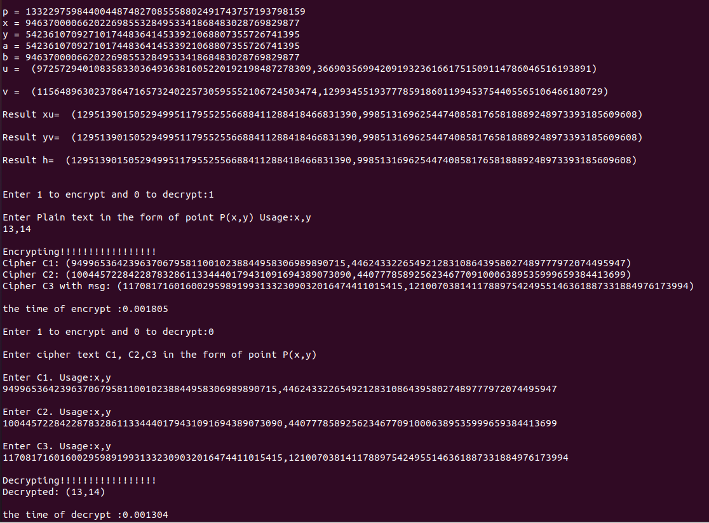

# DLIN-ELGamal-ECC
elgamal-ecc public key encryption scheme based on dlin assumption

## 运行步骤

* 安装依赖

  ```bash
  sudo apt-get install libssl-dev
  sudo apt-get install libgmp3-dev
  ```

* 编译源文件

  ```bash
  gcc elgamal.c -lm -lgmp
  ```

* 运行程序

  ```bash
  ./a.out
  ```

## 运行样例



## 致谢

本项目是基于[github：snehamaganahalli/Elgamal_ECC](https://github.com/snehamaganahalli/Elgamal_ECC)（ECC域上的基于DDH假设的经典ELGamal加密方案）进行再开发的，感谢他！

另外，本项目的实现是基于论文**Short Group Signatures**中提出的LE加密方案（经典ELGamal加密方案的变体）。